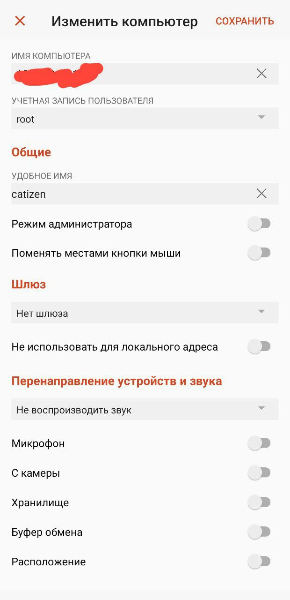

# Предисловие

Данное руководство создано с целью описать процесс установки графической среды для удалённого сервера с возможностью запуска in-app приложений из Telegram.

Для примера будет использоваться приложение [Catizen](https:/t.me/catizenbot)

# Системные требования

Потребуется VPS сервер любого известного вам хостинг провайдера.

ВАЖНО: не все хостинг провайдеры согласны на то, чтобы на их серверах происходил майнинг. Поэтому нет никакой гарантии, что именно ваш провайдер не настучит вам по голове за это. В своем примере я использую провайдера adminvps (работают на территории РФ и РБ).

Минимальные требования к VPS серверу, при которых я не ловил нагоняй от провайдера были такие:

- Процессор: 2 ядра;
- Оперативная память: 2+ Гб;
- ОС: Debian-подобный дистрибутив (к примеру, Ubuntu);
- Память: без разницы.

Цена такого решения выйдет в районе 7$ в месяц.

Ну и естественно нам понадобится доступ к консоли под root пользователем (обычно все провайдеры предлагают такой доступ прямо из личного кабинета или серверной админ панели).

# Установка и настройка

Первым делом требуется обновить репозитории (при появлении диалоговых окон просто делаем ```tab``` -> ```enter```):

```bash
sudo apt-get update
sudo apt-get upgrade -y
```

Далее установим графическую среду, диспетчер экранов, сервер вещания по RDP и браузер firefox (при появлении диалогового окна выбираем **lightdm** и делаем, как и во всех остальных случаях, ```tab``` -> ```enter```):

```bash
sudo apt-get install xfce4 lightdm xrdp firefox
```

Настроим среду:

```bash
sudo adduser xrdp ssl-cert
sudo sed -i 's/allowed_users=console/allowed_users=anybody/' /etc/X11/Xwrapper.config
echo "xfce4-session" | tee ~/.xsession
sudo systemctl restart xrdp
sudo systemctl restart lightdm
```

После этих действия должно быть доступно подключение по RDP протоколу через приложения ([Android](https://play.google.com/store/apps/details?id=com.microsoft.rdc.androidx), [Linux](https://remmina.org/))
Для подключения потребуется IP-адрес сервера, логин (root) и пароль (обычно высылается по почте).

# Использование

Дальнейшие действия такие:

1. Добиться подключения к рабочему столу через любой удобный RDP-клиент (я бы советовал [Android](https://play.google.com/store/apps/details?id=com.microsoft.rdc.androidx));
2. Найти и открыть браузер на рабочем столе;
3. Перейти в web-версию телеграмма;
4. Войти в свой аккаунт;
5. Запустить игру;
6. Закрыть клиент и забыть о ней.

Настройка профиля RDP на Android:



Рабочий стол:


Игровой процесс:


# Заключение

Это был лишь пример на основе Catizen, в реальности запустить можно что угодно, допустим, тот же Hamster Kombat.